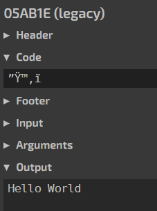

## 一、brainfuck

`brainfuck`是最简单的图灵完备语言，作为一个玩具语言它存在的意义仅在于模拟图灵机（以及参加Hello World大赛）以及供编译原理初学者练练手。有兴趣可以百度一下它简洁的语法然后尝试一下：[brainfuck在线运行,在线工具，在线编译IDE_w3cschool](https://www.w3cschool.cn/tryrun/runcode?lang=brainfuck)

## 二、Betterave

详细介绍：[Betterave - Esolang (esolangs.org)](https://esolangs.org/wiki/Betterave#External_resources)

简单介绍：

+ 语法采用前缀表达式的形式；
+ 26个字母代表26个可定义的变量，大写表示赋值，小写表示取值；
+ `,`的功能是将后面一个返回值作为参数打印其ASCII码字符。

使用Ruby语言编写的解释器运行结果如图

但前缀表达式操作数只识别一位的数字，所以即便像第一名一样直接输出所有字符的ASCII码值也没法超过他：

`A**366,-a*66,-a7,a,a,+a3,-a*37,+a3,+a6,a,-a8`

>  “When the interpreter encounters a digit, its value is immediately returned to the preceding command for further evaluation. This means that to obtain numbers bigger than 9, you will have to use mathematic operations. ”

## 三、bitch

详细介绍：[bitch - Esolang (esolangs.org)](https://esolangs.org/wiki/Bitch#Truth-machine)

截图是介绍里的示例代码，把中间的逗号和末尾的叹号删掉即可。但是显然没有单字符控制输出的语言简单，还是没法胜过第一名。

## 四、Fourier

这个能战胜第一名，因为遇到连续的字母它可以省略一次参数！大胜利！

## 五、05AB1E

这个是目前我发现最有希望秒杀比赛的，如果输出`Hello World `的话，它的简化代码是`”Ÿ™‚ï `

原理很简单，其实等于是直接输出"Hello World "，它把每个单词都压缩到两个字符并存入字典，根据查字典可知`Ÿ™`代表`hello`，`‚ï`代表`world`。但是蛋疼的地方在于，它使用字典里的压缩字符串输出的时候默认是以**空格作为分隔符**以及**全小写**的格式。虽然提供了全角右双引号`”`表示去字典里查询压缩字符并以首字母大写的格式输出、全角右单引号`’`取消单词后的空格分隔符，但这俩**不能嵌套使用**......wiki介绍说这语言是基于栈结构的，但似乎栈深度默认只有1.....有兴趣的可以研究一下我把链接贴在下面。

[Commands · Adriandmen/05AB1E Wiki (github.com)](https://github.com/Adriandmen/05AB1E/wiki/Commands)

[05AB1E – Try It Online (tio.run)](https://tio.run/#osabie)

[Adriandmen/05AB1E: A concise stack-based golfing language (github.com)](https://github.com/Adriandmen/05AB1E)

## 六、学习链接

更多有趣的语言等你学习：[Hello world program in esoteric languages (nonalphabetic and A-M) - Esolang (esolangs.org)](https://esolangs.org/wiki/Hello_world_program_in_esoteric_languages_(nonalphabetic_and_A-M))